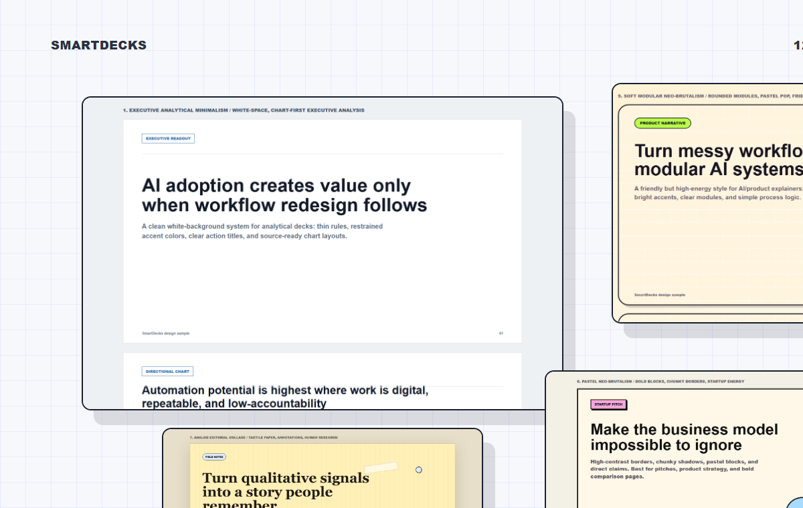
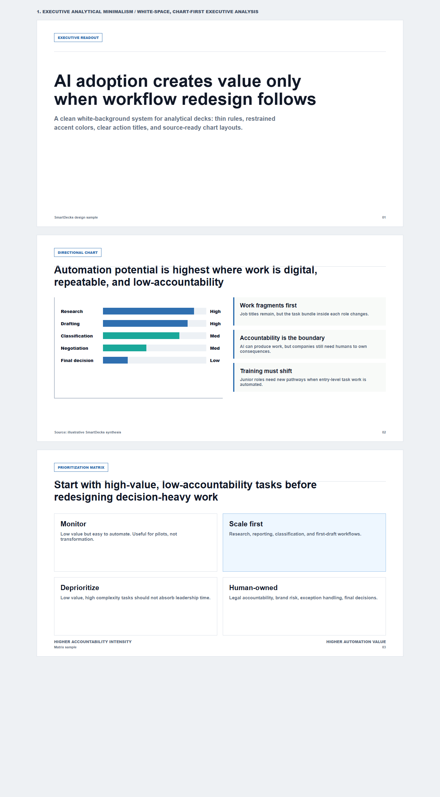
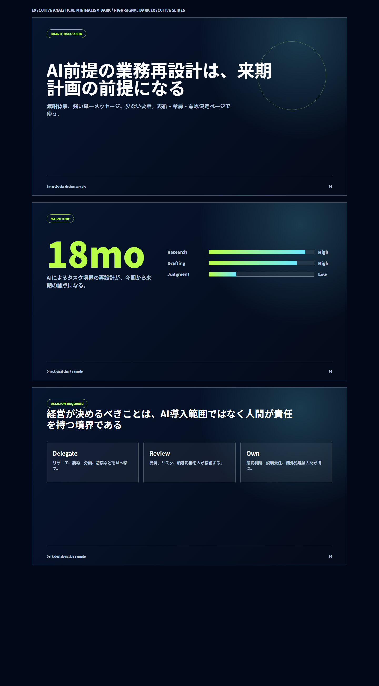
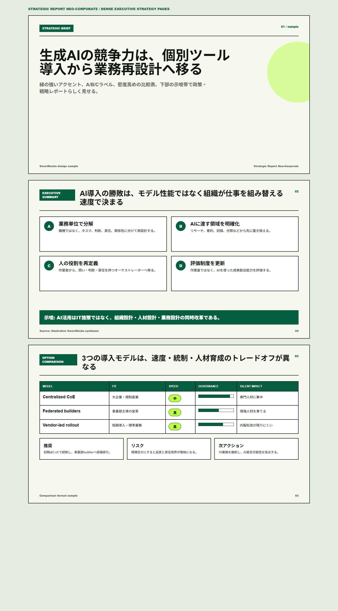
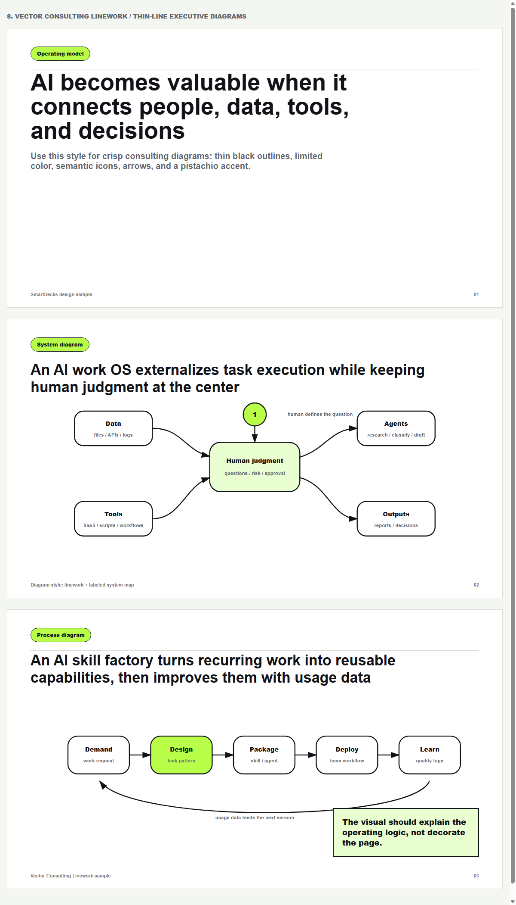
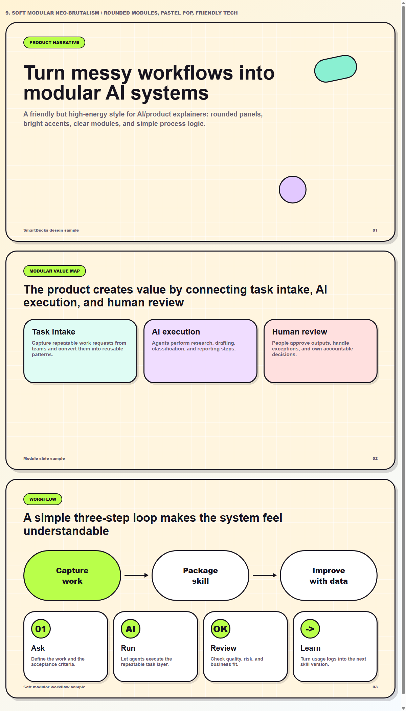
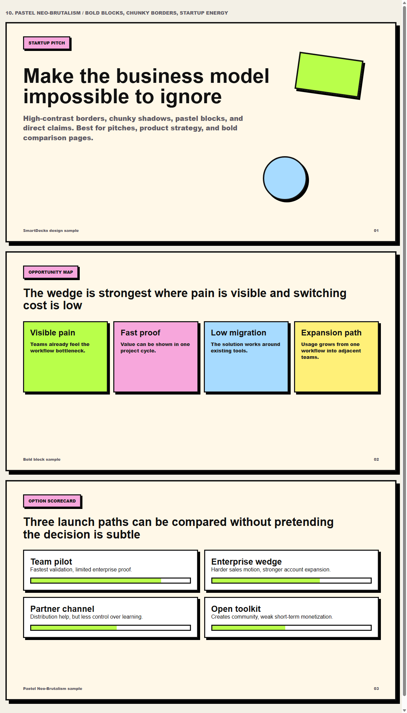
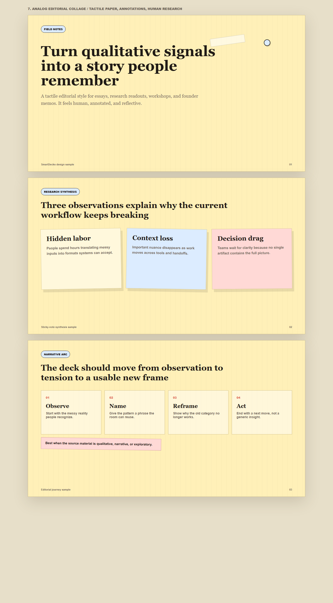
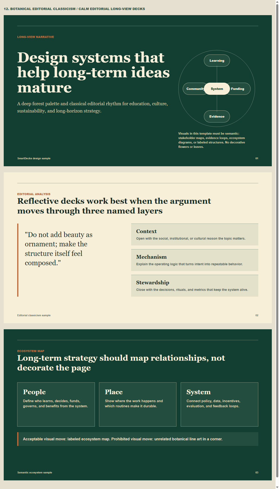

# SmartDecks

SmartDecks is a local Codex skill for turning rough information into structured, visual, presentation-ready decks.

It reads notes, URLs, research summaries, PDFs, meeting notes, tables, and existing deck material, then produces a deck brief, storyline, slide plan, HTML slides or PPTX-ready output, and final visual QA.



## What It Does

- Converts messy source material into executive-ready deck structure
- Interprets material into claims, tensions, causal logic, implications, and decisions instead of only summarizing it
- Uses action titles and one-message-per-slide logic
- Selects charts, tables, matrices, timelines, process flows, icon maps, and explanatory consulting diagrams
- Uses semantic icons only when they replace or compress words, such as data, risk, governance, workflow, decision, or human judgment
- Applies numbered visual templates so you can ask for “template 4” without memorizing names
- Supports HTML slide output and PPTX-oriented planning/rendering rules
- Checks overflow, overlap, contrast, missing sources, weak titles, and excessive text

## Design Templates

SmartDecks includes eight numbered visual directions.

| No. | Template | Best For |
| --- | --- | --- |
| 1 | Executive Analytical Minimalism | White-space, chart-first executive analysis |
| 2 | Executive Analytical Minimalism Dark | High-contrast analytical readouts |
| 3 | Strategic Report Neo-Corporate | Formal strategy and policy reports |
| 4 | Vector Consulting Linework | Line art, icons, diagrams, neon pistachio accents |
| 5 | Soft Modular Neo-Brutalism | Clear modular explainers with playful structure |
| 6 | Pastel Neo-Brutalism | Editorial blocks with softer colors |
| 7 | Analog Editorial Collage | Qualitative research, notes, workshops, narrative synthesis |
| 8 | Botanical Editorial Classicism | Elegant reflective narratives and soft strategy |

Open the visual gallery:

[SmartDecks GitHub Pages](https://0xpandadev.github.io/smartdecks/)

## Sample Previews

| 1 | 2 |
| --- | --- |
|  |  |

| 3 | 4 |
| --- | --- |
|  |  |

| 5 | 6 |
| --- | --- |
|  |  |

| 7 | 8 |
| --- | --- |
|  |  |

## Install

Clone this repository and copy the skill folder into your Codex skills directory.

```powershell
git clone https://github.com/0xpandadev/smartdecks.git
Copy-Item -Recurse -Force .\smartdecks\skill $env:USERPROFILE\.codex\skills\smart-decks
```

After that, call it from Codex:

```text
[$smart-decks] Show template list.
```

## Usage Examples

```text
[$smart-decks] Use template 4.
Turn this article into a 10-slide HTML strategy deck.
Use diagrams, icons, charts where useful, and run final visual QA.
```

```text
[$smart-decks] テンプレ4で。
この調査メモを12枚のHTML資料にして。
必要なところはチャート化し、アイコンと出典を入れて、最後に文字溢れを確認して。
```

```text
[$smart-decks] 使用模板4。
把这份研究笔记做成 12 页 HTML 战略简报。
能图表化的地方请图表化，加入图标和来源页脚，最后检查文字溢出。
```

## 日本語

SmartDecksは、メモ、URL、調査結果、PDF、表データなどを読み取り、構成、ストーリーライン、図表設計、HTML/PPTX向け出力、最終QAまで行うCodexスキルです。

テンプレート名を覚える必要はありません。まず「テンプレ一覧」と依頼し、次に「テンプレ4で」のように番号で指定できます。

## 中文

SmartDecks 是一个本地 Codex 技能，可以把笔记、URL、研究材料、PDF 和结构化数据转成故事线、图表规划、HTML 幻灯片或 PPTX-ready 输出，并进行最终视觉 QA。

你不需要记住模板名称。先让它显示模板列表，然后用“模板4”这样的编号调用即可。

## Repository Structure

```text
skill/              SmartDecks Codex skill
samples/            Visual template sample pages and screenshots
index.html          GitHub Pages gallery with English/Japanese/Chinese switcher
```

## Notes

SmartDecks is an independent project. It is not affiliated with McKinsey, BCG, Anthropic, or OpenAI. Public strategy reports were used only as design-quality references.
