# SmartDecks

SmartDecks is a local Codex skill that turns rough information into structured, visual, presentation-ready decks.

It reads notes, URLs, research summaries, PDFs, meeting notes, tables, and existing deck material, then produces a deck brief, storyline, slide plan, HTML slides or PPTX-ready output, and final visual QA.

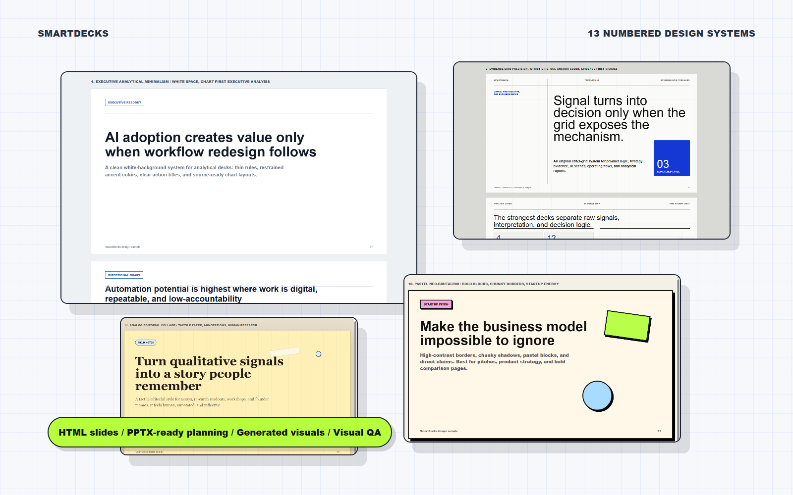

## What It Does

- Converts messy source material into executive-ready deck structure
- Interprets material into claims, tensions, causal logic, implications, and decisions instead of only summarizing it
- Uses action titles and one-message-per-slide logic
- Selects charts, tables, matrices, timelines, process flows, icon maps, and consulting-style explanatory diagrams
- Uses semantic icons only when they explain structure, replace words, identify entities, or encode meaning
- Can use generated photos, infographics, workflow diagrams, UI situation images, and evidence visuals when image generation is available
- Applies numbered visual templates so you can ask for `template 3` or `template 4` without memorizing names
- Supports HTML slide output and PPTX-oriented planning/rendering rules
- Checks overflow, overlap, contrast, missing sources, weak titles, excessive text, and decorative visual misuse

## Design Templates

SmartDecks includes thirteen numbered visual directions. These are reusable visual and information-architecture systems, not fixed deck categories. Each one can support consulting analysis, proposals, business introductions, product stories, investor narratives, data readouts, problem diagnosis, solution recommendations, and executive decision materials.

| No. | Template | Information Pattern |
| --- | --- | --- |
| 1 | Executive Analytical Minimalism | Charts, comparisons, evidence, and recommendations |
| 2 | Executive Analytical Minimalism Dark | Strong conclusions, section transitions, and signal moments |
| 3 | Evidence Grid Precision | Product logic, facts, methodology, UI scenes, analytical layouts, generated evidence visuals |
| 4 | Precision Linework System | Entity maps, milestones, operating facts, roles, locations, and structure |
| 5 | Gradient Grid Editorial | Narrative arcs, concepts, stages, teams, transformation stories, and outcomes |
| 6 | Quantitative Blueprint System | Metrics, forecasts, assumptions, scenarios, economics, and resource logic |
| 7 | Monochrome Signal System | Crisp arguments, business models, modules, traction, and decision paths |
| 8 | Strategic Report Neo-Corporate | Multi-option evidence, policy logic, implications, and dense executive structure |
| 9 | Vector Consulting Linework | Workflows, operating models, causal loops, and value chains |
| 10 | Soft Modular Neo-Brutalism | Modular systems, capability maps, and workflow loops |
| 11 | Pastel Neo-Brutalism | Bold comparisons, options, business models, and launches |
| 12 | Analog Editorial Collage | Qualitative synthesis, field notes, and narrative evidence |
| 13 | Botanical Editorial Classicism | Ecosystems, long-horizon arguments, and reflective strategy |

Open the visual gallery:

[SmartDecks GitHub Pages](https://0xpandadev.github.io/smartdecks/)

## Sample Previews

| 1 | 2 |
| --- | --- |
| 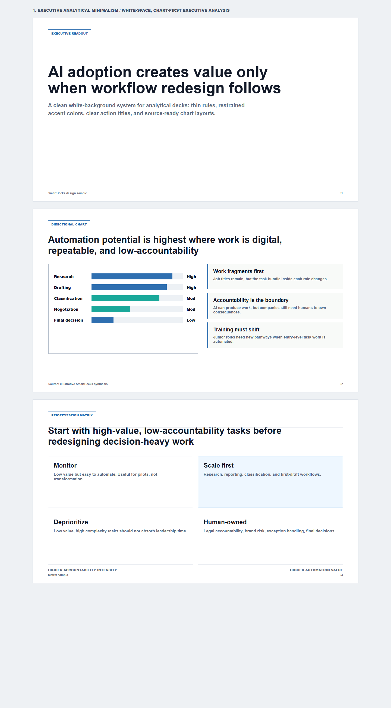 | 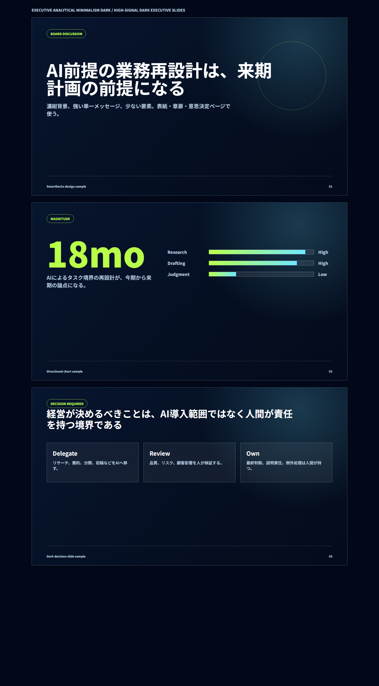 |

| 3 | 4 |
| --- | --- |
| 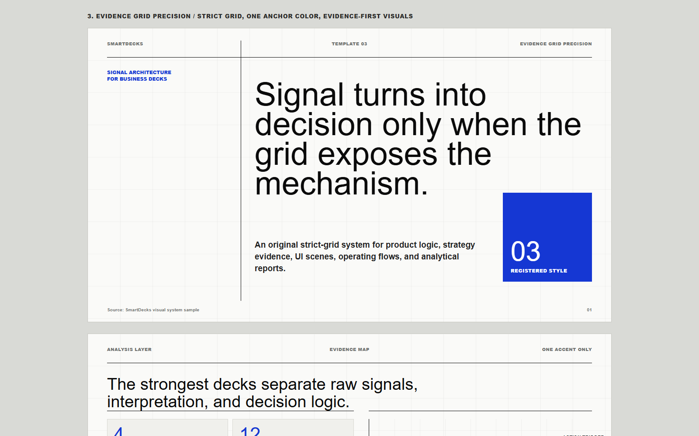 | 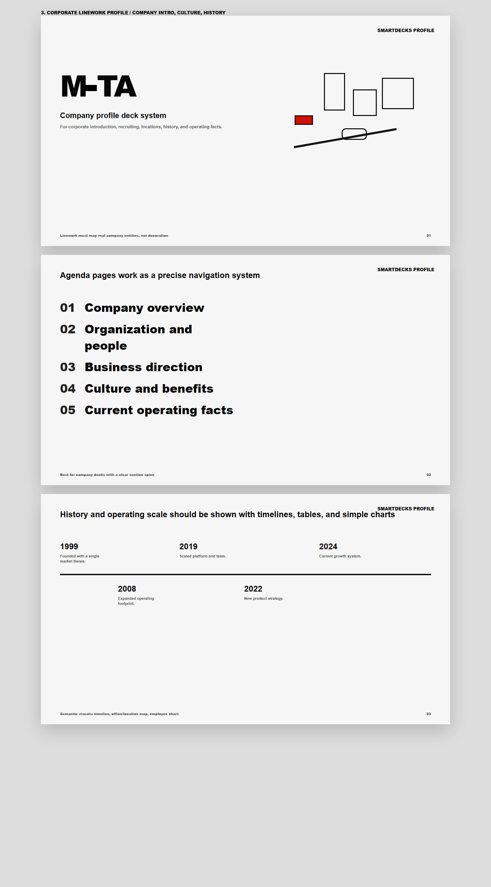 |

| 5 | 6 |
| --- | --- |
| 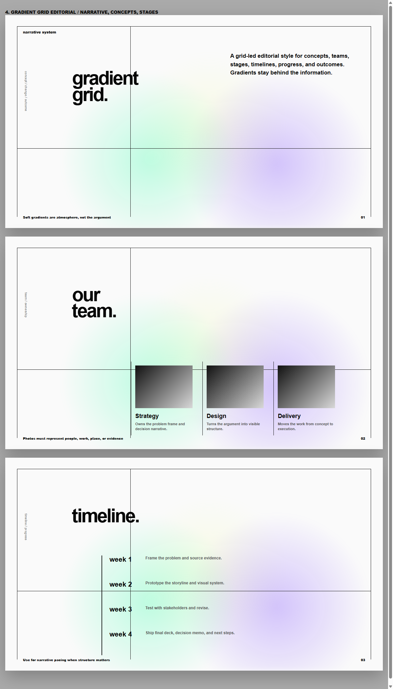 | 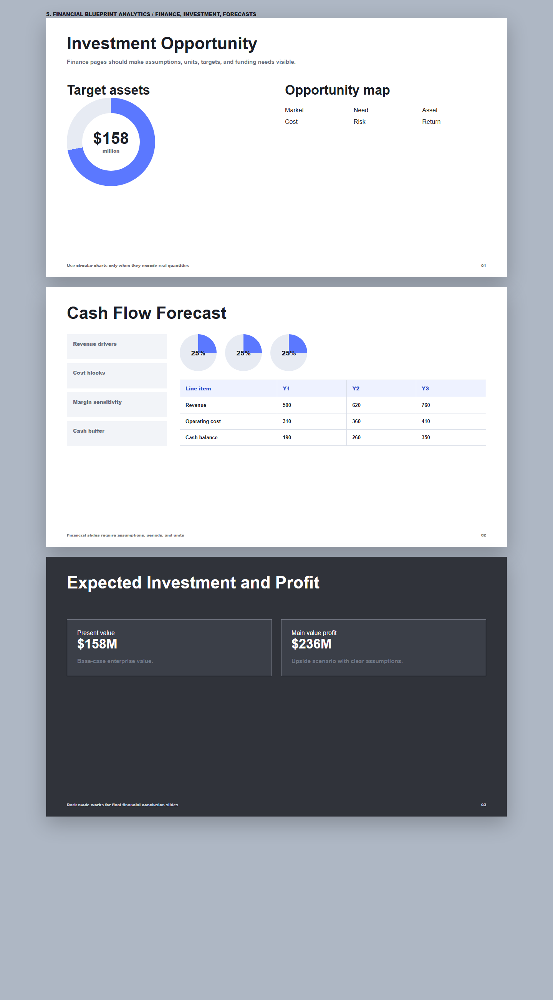 |

| 7 | 8 |
| --- | --- |
| 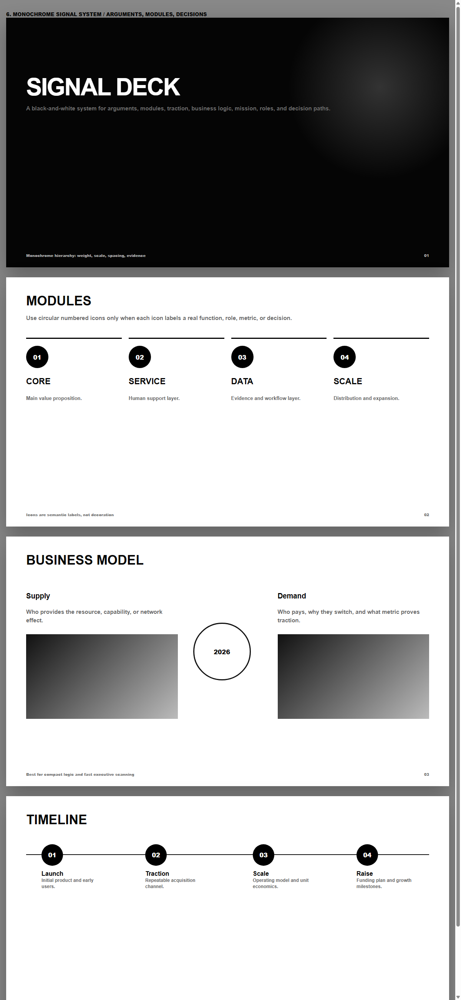 | 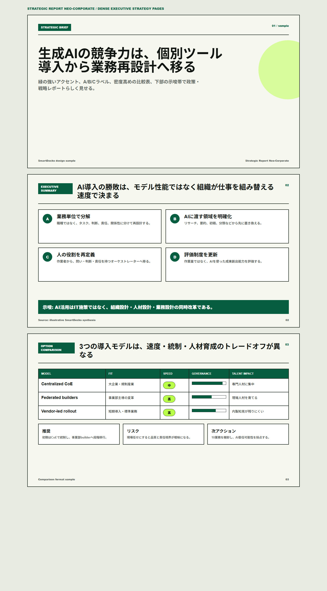 |

| 9 | 10 |
| --- | --- |
| 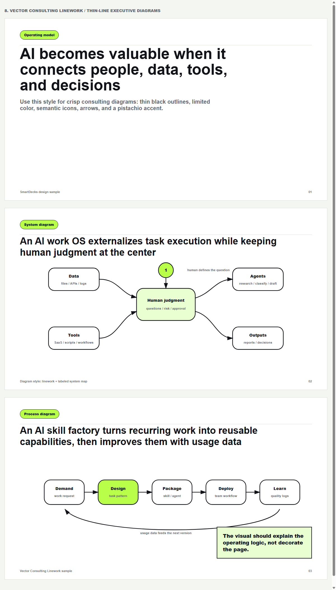 | 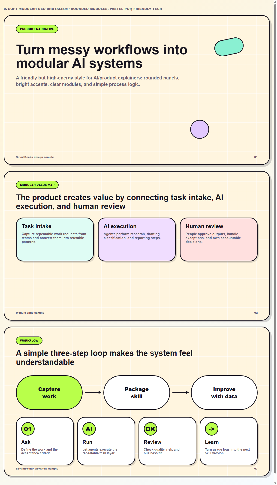 |

| 11 | 12 |
| --- | --- |
| 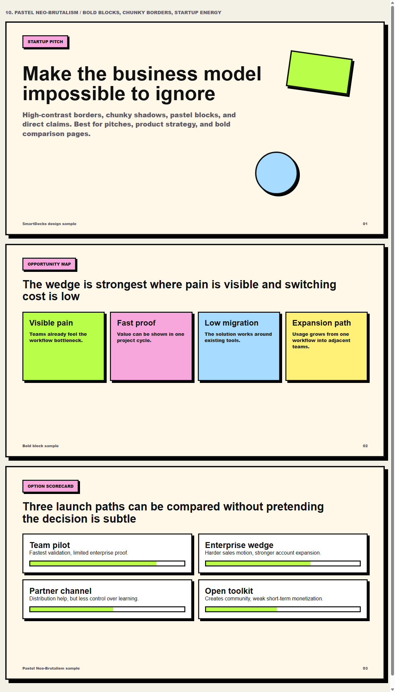 | 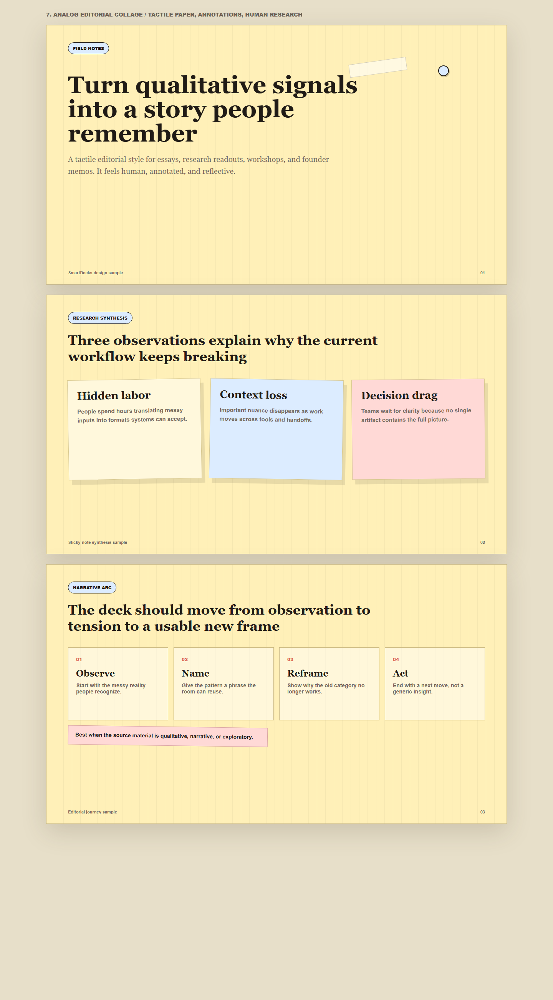 |

| 13 |
| --- |
| 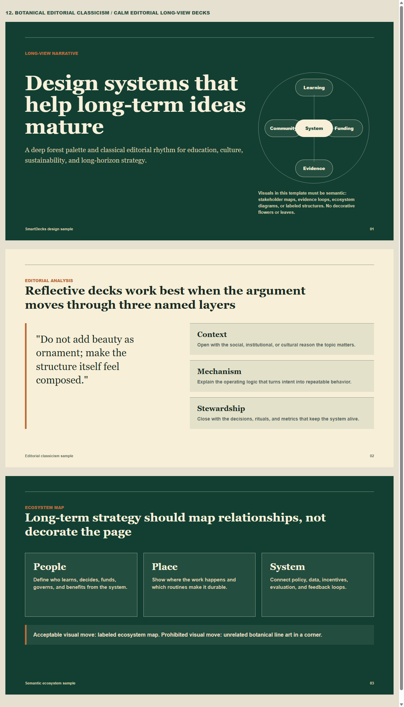 |

## Generated Visuals

SmartDecks can plan and insert generated assets when the Codex environment provides image generation, including GPT-Image / GPT-M-style tools. The rule is strict: generated visuals are slide assets, not decoration.

Good generated assets:

- an infographic that explains a mechanism
- a workflow or pipeline diagram
- a UI situation image that makes a product or operating model concrete
- a documentary-style context image
- a data poster or evidence grid

Rejected assets:

- random flowers, leaves, ornaments, or filler illustrations
- fake logos or invented screenshots
- full-slide images with headers, page numbers, or fake slide chrome
- visuals that do not support the slide message

## Install

Clone this repository and copy the skill folder into your Codex skills directory.

```powershell
git clone https://github.com/0xpandadev/smartdecks.git
Copy-Item -Recurse -Force .\smartdecks\skill $env:USERPROFILE\.codex\skills\smart-decks
```

After that, call it from Codex:

```text
[$smart-decks] Show template list.
```

## Usage Examples

```text
[$smart-decks] Use template 3.
Turn this article into a 10-slide HTML strategy deck.
Use charts, semantic icons, and generated evidence visuals only where they clarify the argument.
Run final visual QA.
```

```text
[$smart-decks] テンプレ3で。
この調査メモを12枚のHTML戦略資料にして。
必要なところは図表化し、意味あるアイコンと生成画像だけ使って、最後に文字溢れをQAして。
```

```text
[$smart-decks] 使用模板3。
把这份研究笔记做成12页HTML战略报告。
能图表化的地方请图表化，只使用有意义的图标和生成视觉，最后检查文字溢出。
```

## 日本語

SmartDecksは、メモ、URL、調査結果、PDF、表データなどを読み取り、構成、ストーリーライン、図表設計、HTML/PPTX向け出力、最終QAまで行うローカルCodexスキルです。

テンプレート名を覚える必要はありません。まず「テンプレート一覧」と依頼し、次に「テンプレ3で」のように番号で指定できます。

## 中文

SmartDecks 是一个本地 Codex 技能，可读取笔记、URL、研究资料、PDF 和表格数据，并生成结构、故事线、图表方案、HTML/PPTX-ready 输出和最终视觉QA。

你不需要记住模板名称。先让技能显示模板列表，然后在下一条请求中引用编号，例如“使用模板3”。

## Repository Structure

```text
skill/              SmartDecks Codex skill
samples/            Visual template sample pages and screenshots
assets/             GitHub Pages preview assets
index.html          GitHub Pages gallery with English/Japanese/Chinese switcher
```

## Notes

SmartDecks is an independent project. It is not affiliated with McKinsey, BCG, Anthropic, or OpenAI. Public strategy reports and public design references are used only as quality references.
